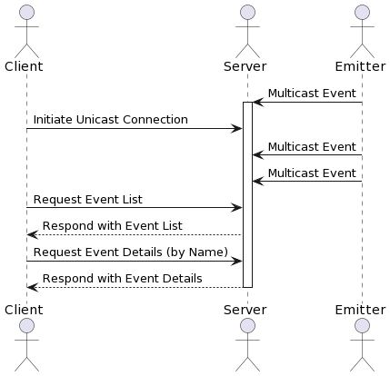
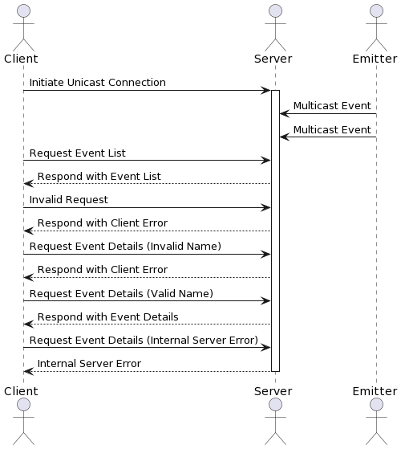

# Event Notifier
## Description

This is a simple event notifier that can be used for cities to send events to the server.
Clients can then access the server and get a list of all events or get more information about a specific event.

## Table of Contents
- [Prerequisites](#prerequisites)
- [Getting Started](#getting-started)
    - [Building the Project](#building-the-project)
    - [Running with Docker](#running-with-docker)
- [Usage](#usage)
    - [Event Emitter](#event-emitter)
    - [Event Server](#event-server)
    - [Event Client](#event-client)
- [Docker Compose](#docker-compose)
- [Application Protocol](#application-protocol)
    - [Initiating a connection](#initiating-a-connection)
    - [Messages and Actions](#messages-and-actions)
    - [Input and Output](#input-and-output)
- [Diagrams](#diagrams)
    - [Happy Path](#happy-path)
    - [Error Path](#error-path)

## Pre-requisites

- Java 17
- Docker

## Getting started
### Building the project
1. Clone the repository
```bash
git clone git@github.com:RemyBlr/dai-bleuer-lopez-practical-work-3.git
cd dai-bleuer-lopez-practical-work-3
```
2. Build the project
```bash
./mvnw package
```

### Running with docker
1. Build the docker image
```bash
docker-compose build
```
2. Run the docker container
```bash
docker-compose up
```
This will start the event emitter, the event server and the event client in isolated containers.


## Usage
### Event emitter
The event emitter is a simple program that will send events to the server. Either random or defined events.
You can run multiple instances of the event emitter to simulate multiple cities sending events to the server.
```bash
docker-compose run event-emitter-1
```
### Event server
The event server listens for multicast and unicast messages.
```bash
docker-compose run event-server
```
### Event client
The event client interacts with the event server to retrieve and display events.
```bash
docker-compose run event-client
```

## Docker compose
Docker Compose is used to manage the containers for the event emitter, event server, and event client.
The containers are connected to a custom network (events-network) to facilitate communication.

## Application protocol
The application protocol we used is defined by the following details:

### Initiating a connection
The client sends a unicast message to the server to initiate a connection.

### Messages and Actions
- Multicast events     : The event emitter sends random events to the multicast group.
- Unicast list         : The event client requests a list of all events from the event server.
- Unicast event detail :The event client requests details for a specific event by name from the event server.

### Input and Output
- Multicast Event: 
  - No input. 
  - Output includes details of the multicast event.
- Unicast List: 
  - No input. 
  - Output includes a list of all events.
- Unicast Event Details: 
  - Input is the name of the event.
  - Output includes details of the requested event (by name).

## Diagrams
### Happy path


### Error path

